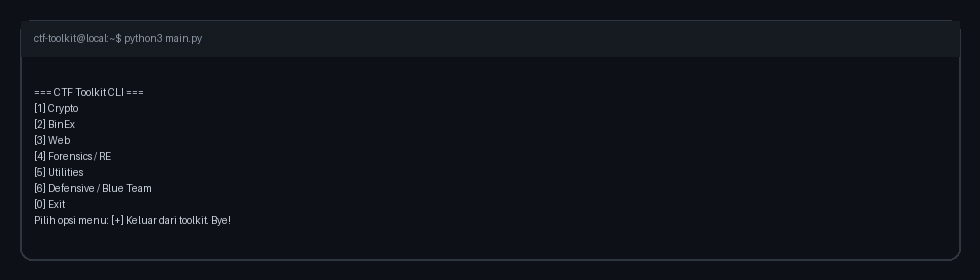
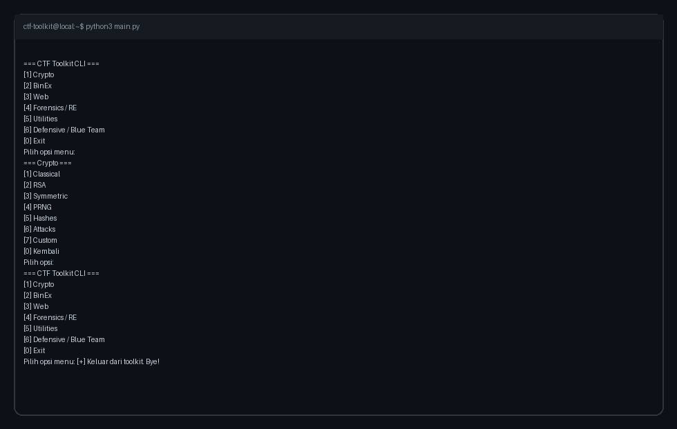
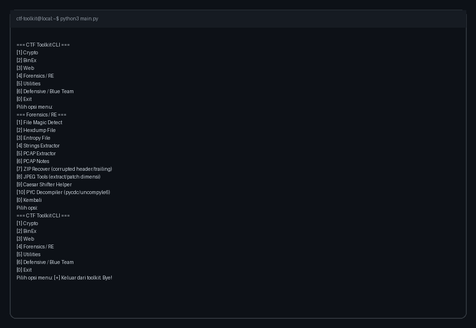

# CTF Toolkit

> Terminal-first CTF helper toolkit for legal labs and learning environments.
> Toolkit ini dirancang untuk praktik cepat, modular, dan tetap aman untuk konteks pembelajaran.


---

```text
┌─────────────────────────────────────────────────────────────┐
│  CTF Toolkit :: modular menus for Crypto/BinEx/Web/DFIR   │
│  Fast iteration, reproducible output, legal-lab usage only │
└─────────────────────────────────────────────────────────────┘
```

## Table of Contents
- [Overview](#overview)
- [Feature Matrix](#feature-matrix)
- [Quickstart](#quickstart)
- [Run Modes](#run-modes)
- [CLI Preview (Real Output)](#cli-preview-real-output)
- [Input Patterns](#input-patterns)
- [Project Layout](#project-layout)
- [Safety & Legal Notice](#safety--legal-notice)
- [Validation](#validation)
- [AI Assistant Docs](#ai-assistant-docs)
- [License](#license)

## Overview
CTF Toolkit adalah kumpulan utilitas CLI untuk challenge workflow: decoding, crypto analysis, binary helper, web payload helper, forensics offline, dan defensive triage.

Semua fitur diorganisir lewat menu domain agar pengguna baru tetap mudah mengikuti alur.

## Feature Matrix

| Domain | Highlights |
|---|---|
| **Crypto** | Classical cipher helper, RSA helper/attacks, AES utilities, PRNG & hash helpers |
| **BinEx** | Cyclic pattern, offset finder, memory wrapper checks, pack/unpack, ELF triage |
| **Web** | URL/Base64URL/JWT decode helper, manual request templates, IDOR matrix |
| **Forensics / RE** | File magic, hexdump, entropy, strings, PCAP offline extractor, ZIP/JPEG/PYC tools |
| **Utilities** | Encoding/XOR helper, XOR brute force, regex flag finder, scanner & HTTP tester |
| **Defensive / Blue Team** | Log anomaly detection, network artifact extraction, digital artifact discovery |

## Quickstart

```bash
python3 -m venv .venv
source .venv/bin/activate
pip install -r requirements.txt
python3 main.py
```

## Run Modes

```bash
# direct entrypoint
python3 main.py

# module mode
python3 -m ctf_toolkit

# optional install mode
pip install .
ctf-toolkit
```

## CLI Preview (Real Output)

> Semua screenshot berikut diambil dari output toolkit nyata, lalu disimpan lokal di `docs/assets/` agar link lebih stabil.

### Main Menu



### Crypto Menu



### Forensics / RE Menu



## Input Patterns
Beberapa modul menerima format bytes berikut:

- `raw:plain_text`
- `hex:414243`
- `b64:QUJD`
- tanpa prefix: auto-parse

Untuk XOR tertentu, byte-list juga didukung, contoh: `0x43, 100, 0x60`.

## Project Layout

```text
ctf_toolkit/
  __init__.py
  __main__.py
  cli.py
  main_cli.py
  registry.py
  ui/
    crypto/
    binex/
    web/
    forensics/
    utilities/
    defensive/
main.py
requirements.txt
docs/assets/
```

## Safety & Legal Notice

> ⚠️ **Learning & Legal Use Only**
>
> - Gunakan toolkit ini hanya pada challenge, lab, atau sistem yang Anda miliki/izinkan.
> - Tidak ditujukan untuk auto-exploit pada target nyata.
> - Analisis file/pcap dilakukan offline; JWT decode helper tidak memverifikasi signature.

## Validation

```bash
python3 -m py_compile $(find . -name '*.py' -not -path './.venv/*')
printf '0\n' | python3 main.py
```

## AI Assistant Docs
- Copilot guidance: [`copilot.md`](copilot.md)
- Claude guidance: [`claude.md`](claude.md)

## License
See [LICENSE](LICENSE).
